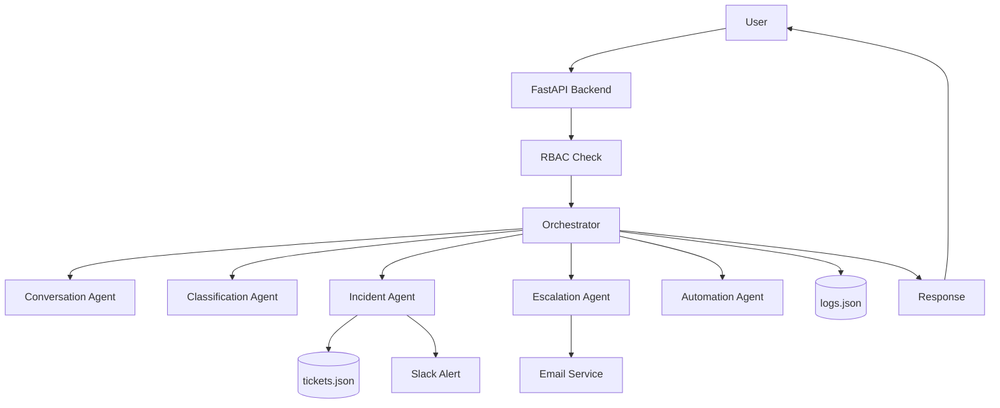
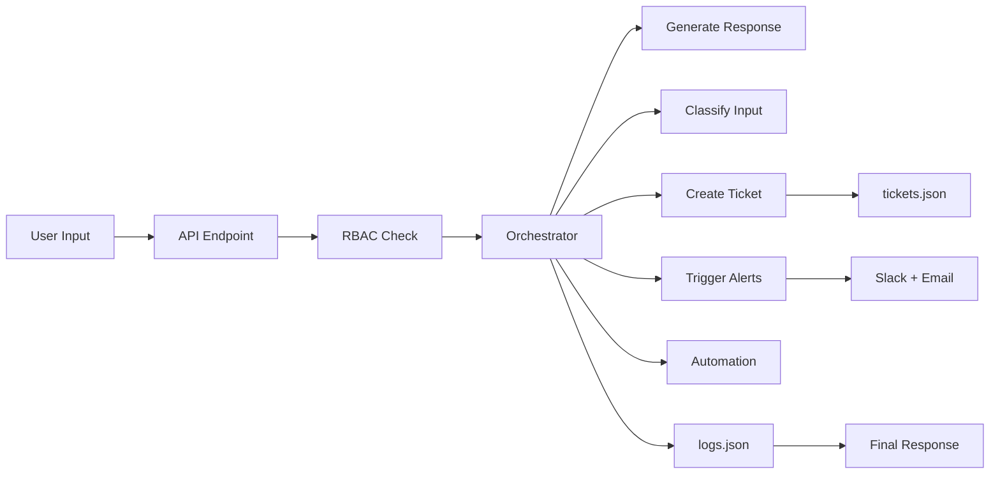
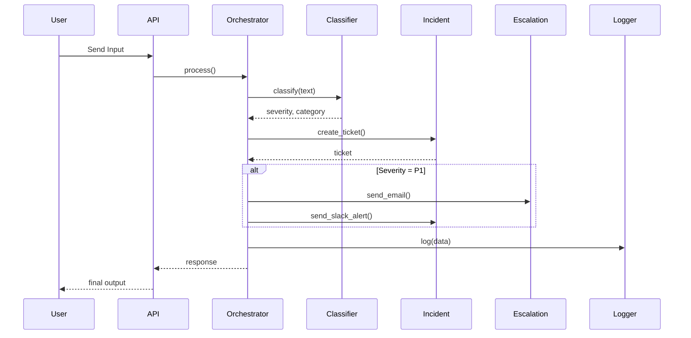

# 🚀 OmniAgent AI

## 🔥 Overview

OmniAgent AI is a **multi-agent intelligent system** designed for real-time **incident detection, classification, and automated response** using LLMs.

It simulates a production-grade system where input is processed through multiple agents to generate **alerts, tickets, logs, and responses**.

---

## ✨ Key Features

* 🧠 Multi-agent architecture
* 🤖 LLM-powered classification (Ollama)
* 🚨 Real-time incident detection
* 🔔 Slack alerting (P1 incidents)
* 📧 Email escalation
* 🎟️ Ticket generation system
* 📊 Logging & monitoring
* 🔐 RBAC security
* ⚡ FastAPI backend
* 🖥️ Streamlit UI

---

## 🏗️ High-Level Architecture



---

## 🔄 System Flow



---

## 🔁 Sequence Diagram



---

## ⚙️ Tech Stack

* **Backend**: FastAPI  
* **Frontend**: Streamlit  
* **LLM**: Ollama (local models like mistral)  
* **Storage**: JSON (logs & tickets)  
* **Alerts**: Slack Webhook  
* **Email**: SMTP (Gmail)  
* **Language**: Python  

---

## 🚀 API Endpoints

### 🔹 `/process`

```json
{
  "input": "someone is attacking me with a knife"
}
```

---

### 🔹 `/chat`

```json
{
  "message": "Hello"
}
```

---

### 🔹 `/health`

Health check endpoint

---

## 🚨 Severity Levels

| Level | Meaning |
|------|--------|
| P1 | Critical (Slack + Email) |
| P2 | High |
| P3 | Medium |
| P4 | Low |

---

## 🔐 Security Features

* Rate limiting (5 req / 10 sec)
* Input validation
* RBAC authorization
* Payload size restriction
* Middleware error handling

---

## 📊 Logging & Storage

* `tickets.json` → incident tracking  
* `logs.json` → system logs  
* Metrics tracking for severity  

---

## 📂 Project Structure

```text
Ai_multimodel_detection/
│
├── omniagent-ai/
│   ├── app/
│   │   ├── agents/
│   │   ├── workflows/
│   │   ├── utils/
│   │   ├── services/
│   │   └── main.py
│
├── ui/
│   └── streamlit_app.py
│
├── multimodel/
│
├── data/
│   ├── logs.json
│   └── tickets.json
```

---

## ⚙️ Setup

### 1. Clone

```bash
git clone https://github.com/YOUR_USERNAME/omniagent-ai.git
cd omniagent-ai
```

---

### 2. Setup Environment

```bash
python -m venv venv
venv\Scripts\activate
pip install -r requirements.txt
```

---

### 3. Configure `.env`

```env
OLLAMA_BASE_URL=http://localhost:11434
OLLAMA_MODEL=mistral

EMAIL_USER=your_email@gmail.com
EMAIL_PASS=your_app_password
EMAIL_TO=receiver_email@gmail.com

SLACK_WEBHOOK_URL=your_webhook_url

RBAC_ROLE=admin
```

---

### 4. Run Ollama

```bash
ollama serve
ollama pull mistral
```

---

### 5. Start Backend

```bash
uvicorn app.main:app --reload
```

---

### 6. Run UI

```bash
streamlit run ui/streamlit_app.py
```

---

## 🧪 Example Execution

**Input**

```
someone is attacking me with knife
```

**Output**

* Severity → P1  
* Slack alert → triggered  
* Email → sent  
* Ticket → created  
* Logs → recorded  

---

## 🧠 Design Approach

This system follows a **hybrid architecture**:

* LLM → understanding context  
* Rules → enforcing reliability  
* Agents → modular execution  

---

## 📌 Current Limitations

* Rule-based fallback classification  
* No RAG yet  
* No multimodal support  
* JSON storage (no DB)  
* Synchronous execution  

---

## 🚀 Future Enhancements

* RAG (vector DB: FAISS / ChromaDB)  
* Multimodal inputs (image/audio)  
* Async pipelines (Kafka / Celery)  
* Docker + Kubernetes deployment  
* Monitoring dashboard  
* PostgreSQL integration  

---

## 👨‍💻 Author

Kvaishnavi  

---

## ⭐ Final Note

This project demonstrates:

* System design thinking  
* LLM integration  
* Real-world automation pipeline  

Suitable for:

* Data Scientist  
* ML Engineer  
* AI Engineer  
